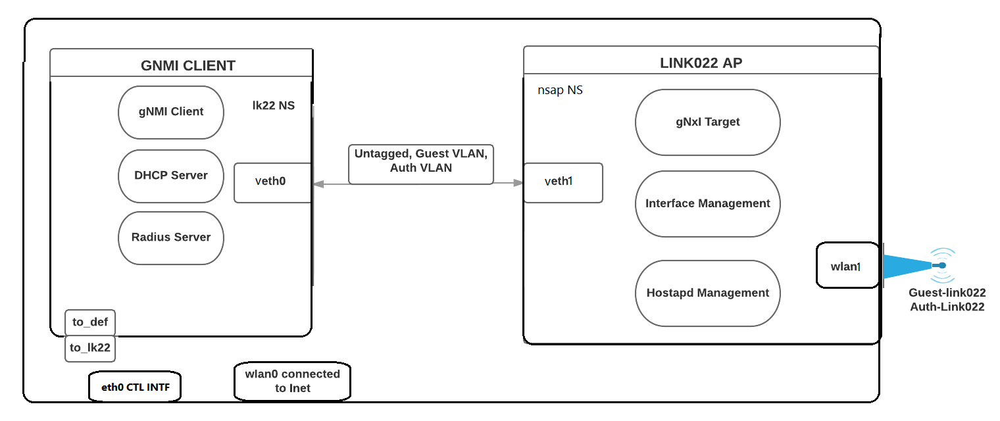

## Getting Started
The following instructions will get you a Link022 AP and its GW on a single Raspberry Pi device .

### Prerequisites
Have a Raspberry Pi device set up, with a wifi dongle. (Tested with Raspbian)

# Link022 Demo
This doc contains the steps to run a demo.

## Setup demo environment
Here is the structure of the demo setup.


The setup uses network namespaces one for Link022 AP and another for the gnmi client, linked  by veth pari.
  - The Link022 AP (gnmi target) in nsap network namespace with wlan1 and veth1
  - The gateway (gnmi client) in lk22 and it provides reqiured services (dhcp, radius and gnmi client).

### Prerequesit software
1. Install Golang on Raspberry Pi.
```
wget https://storage.googleapis.com/golang/go1.7.linux-armv6l.tar.gz
sudo tar -C /usr/local -xzf go1.7.linux-armv6l.tar.gz
export PATH=$PATH:/usr/local/go/bin
```
2. Install dependencies for the Link022 AP
```
sudo apt-get install udhcpc bridge-utils hostapd
```
3. Install dependencies for the gateway 
``` 
sudo apt-get install dnsmasq freeradius
```
4. Download GNMI clients for the gateway.
```
export GOPATH=$HOME/go
go get github.com/google/gnxi/gnmi_set
go get github.com/google/gnxi/gnmi_get
```
5. Download gNMI agent for the link022 AP
```
export GOPATH=$HOME/go
go get github.com/google/link022/agent
```

# Download demo folder
From github.com/alshaboti/link022/tree/master/demo
server folder contains gnmi agent (Link022 AP) certificates, client folder contains gnmi client (gateway) certificates. These certificates created for a gnmi target name=www.example.com
Or you can use your own cert.

Demo folder also contains freeradius configuration file pre-configured with default values. 

### Configuring network interfaces of Pi
Editing the file /etc/network/interfaces on Pi.
```
auto lo
iface lo inet loopback

auto eth0
iface eth0 inet dhcp

# Disable all WLAN interfaces.
auto wlan0
iface wlan0 inet static
    address 0.0.0.0

# Repeat for other WLAN interfaces.
```
Note: Reboot the device to make change take effect.

### Setup Gateway
On the Link022 AP device, run the commands in this [instruction](../demo/README.md). 
Note: skep go installation step.
